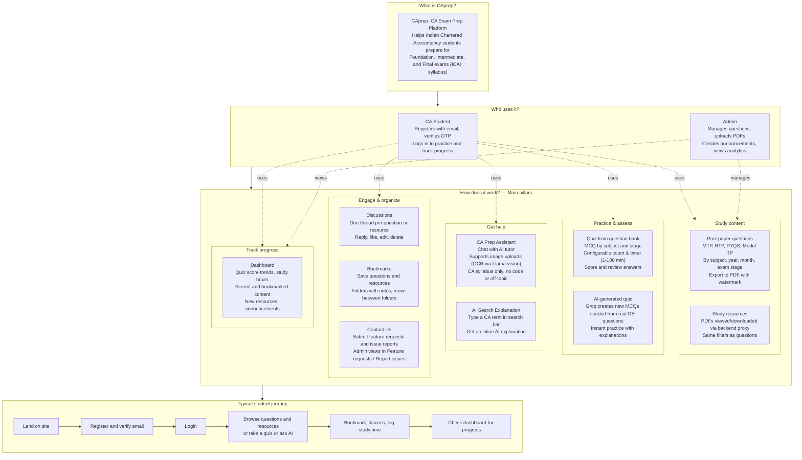
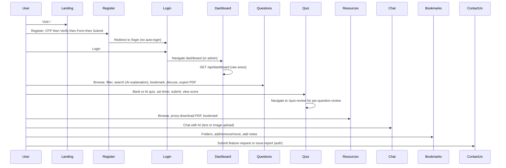
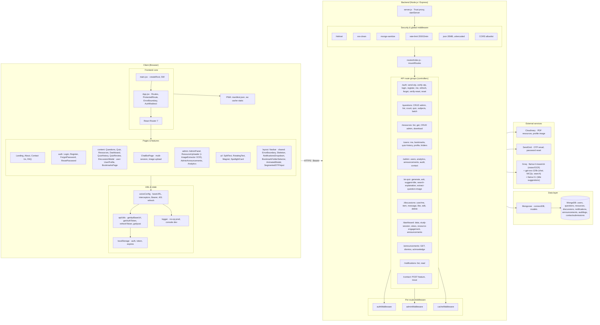
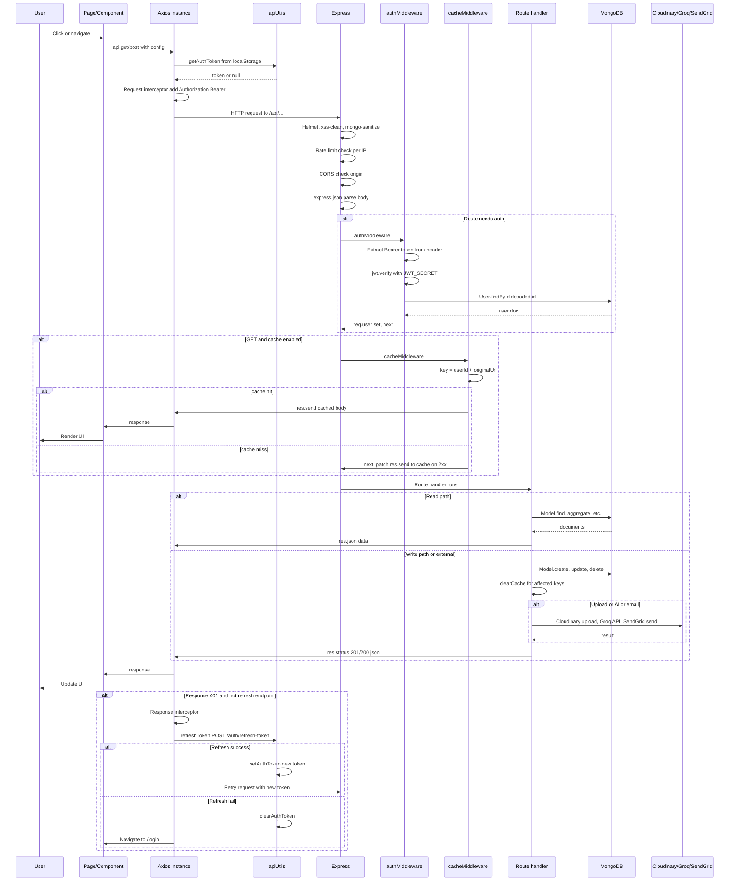
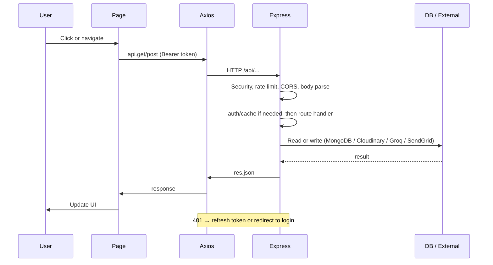

# CAprep

**CAprep** is a full-stack web application for Indian Chartered Accountancy (CA) exam preparation. It brings past papers (MTP, RTP, PYQS, Model TP), practice questions, AI-generated quizzes, study resources (PDFs), discussions, bookmarks, progress tracking, and an AI chat assistant together in one place — all organized around the Foundation, Intermediate, and Final exam stages. The AI layer is powered by Groq and goes beyond simple chat: it can read images of question papers using vision models, extract structured question data from those images for the admin to upload directly, and explain CA-specific search terms inline on the questions page.

---

## Table of Contents

1. [Project Title & Overview](#1-project-title--overview)
2. [Problem Statement](#2-problem-statement)
3. [Key Features](#3-key-features)
4. [Tech Stack](#4-tech-stack)
5. [System Architecture](#5-system-architecture)
6. [Folder Structure Breakdown](#6-folder-structure-breakdown)
7. [API Documentation Overview](#7-api-documentation-overview)
8. [Database Design](#8-database-design)
9. [Authentication & Security](#9-authentication--security)
10. [Environment Variables](#10-environment-variables)
11. [Installation Guide](#11-installation-guide)
12. [Production Deployment Guide](#12-production-deployment-guide)
13. [Scripts & Commands](#13-scripts--commands)
14. [Future Feature Ideas](#14-future-feature-ideas)
15. [Business Ideas (Freemium Monetization)](#15-business-ideas-freemium-monetization)

---

## 1. Project Title & Overview

- **Title:** CAprep  
- **Purpose:** Help CA students prepare for ICAI exams by providing:
  - Curated and AI-generated practice questions (MCQs)
  - Downloadable study resources (PDFs) by subject, paper type, year, and month
  - Quiz taking with scoring and history
  - AI tutor (chat) for CA syllabus–related questions
  - Discussions on questions and resources
  - Bookmarks (flat and folder-based), profile, and dashboard with study analytics

The system is built as a **monolith**: a React (Vite) frontend and an Express.js backend that connects to MongoDB, with file storage on Cloudinary and email via SendGrid.

---

## 2. Problem Statement

CA students need:

- **Structured practice** aligned with ICAI syllabus and exam stages (Foundation, Intermediate, Final).
- **Past papers and resources** in one place, filterable by subject, paper type, and period.
- **Self-assessment** through quizzes and progress tracking.
- **Clarifications** on concepts without always depending on human tutors.
- **Organization** of study material (bookmarks, folders, notes) and visibility into progress (study hours, quiz trends).

CAprep addresses these by providing a single platform for questions, resources, AI-generated quizzes, an AI chat assistant, discussions, bookmarks, and a dashboard.

---

## 3. Key Features

- **Authentication & user management**
  - Email/password registration with **OTP email verification** (SendGrid); OTPs expire in 15 mins; rate limited to 3 per 15 mins.
  - Login with rate limiting and optional token refresh.
  - Forgot password flow: request OTP → verify OTP → set new password.
  - Profile: update name, profile picture (Cloudinary), view bookmarks and quiz history.
  - Account deletion with password confirmation.

- **Questions**
  - List/filter questions by subject, paper type, year, month, exam stage, search, and bookmarked.
  - Search query is escaped before use in MongoDB `$regex` to prevent injection and ensure predictable behavior.
  - Pagination (default 20, max 100 per page).
  - Admin: create, update, delete questions (Joi validation).
  - Question model supports main question, sub-questions, and sub-options (MCQs).

- **Resources (PDFs)**
  - List/filter by subject, paper type, exam stage, year, month, search, bookmarked.
  - Search query is escaped before use in MongoDB `$regex` (title/description) for safe, literal matching.
  - Pagination; single resource by ID.
  - Admin: upload PDF (multer → Cloudinary, 20MB limit), update metadata, delete (Cloudinary asset removed).
  - Download: authenticated; backend can proxy Cloudinary PDF or return download URL; download count incremented.

- **Quizzes**
  - **Bank quiz:** MCQ questions from DB by exam stage and subject (random sample via MongoDB `$sample` aggregation).
  - **AI quiz:** Groq generates fresh MCQs by subject and exam stage; seeds the prompt with up to 30 real questions from the DB as style examples so the AI knows the format; returns JSON with options, correct index, and a plain-English explanation per question.
  - Quiz results (score, total, percentage, per-question attempt detail) saved to user's quiz history; subject strength scores auto-recomputed from last 30 attempts per subject after each save.

- **AI Chat (CA Prep Assistant)**
  - Authenticated chat with Groq; strict system prompt keeps it CA-syllabus-only (no code, no general questions, no recipes).
  - **Image input:** Users can upload an image of a question paper into the chat. The backend first sends the image to Groq's `meta-llama/llama-4-maverick-17b-128e-instruct` vision model to extract the text verbatim, then feeds that extracted text as additional context into the chat answer from `openai/gpt-oss-120b`. This means the AI can read handwritten or printed question paper images and answer based on them.
  - Conversation history is maintained per chat session; per-user chat sessions are stored in `localStorage` (keyed by user ID); title suggestions for saved chats are generated by a separate AI call.

- **AI Search Explanation**
  - When a user types a meaningful CA-related term in the questions search bar (e.g. "amalgamation", "deferred tax"), an inline explanation box appears below the filter bar with a 100–150 word AI-generated summary of that concept in the CA curriculum context.
  - Common/trivial words (stop words) are filtered out and don't trigger the AI call — so searching "the" or "a" won't hit the API.

- **OCR: Image-to-Question Extraction (Admin)**
  - Admins can upload a photo or scan of a question paper in `ResourceUploader`. A two-stage AI pipeline runs: Stage 1 (Llama-4-Maverick vision) extracts raw verbatim text from the image; Stage 2 (`openai/gpt-oss-120b`) structures that text into clean JSON — with HTML tables, sub-questions, and MCQ options pre-filled. The result populates the question creation form automatically, so admins don't have to type out long questions manually.


- **Discussions & Notifications**
  - One discussion thread per item (question or resource); messages with optional parent; like; edit/delete.
  - **In-app & Email Notifications:** Users get in-app notifications and SendGrid emails when someone replies to their discussion post.

- **Bookmarks**
  - **Flat:** bookmarked question IDs and resource IDs on user.
  - **Folders:** create folders (question/resource), add items with optional notes, rename folder, remove item, update note, move item between folders.

- **Dashboard**
  - Aggregated data: quiz score trends, study hours (daily/weekly/monthly/by subject), recently viewed questions/resources, bookmarks, subject strengths, resource engagement (time spent, access count), new resources (last 14 days), active announcements.

- **Study tracking**
  - Study session (e.g. Pomodoro): POST hours + optional subject/date.
  - Question view and resource view: track recently viewed and resource engagement (time spent, access count).

- **Announcements**
  - Admin: create/update/delete; type, priority, target subjects, valid until.
  - Joi validation on create/update: type and priority enums, targetSubjects array shape and length, validUntil as ISO date or timestamp; 400 on invalid payload.
  - On create, in-app notifications are created for all users (fire-and-forget).
  - Users: list active announcements (by validity and priority).

- **Notifications**
  - In-app notifications (announcement, reply, system, general); list (paginated), unread count, mark one or all as read.

- **Contact / feedback**
  - Authenticated users can submit feature requests (featureTitle, optional category, description) and issue reports (subject, description) from the Contact Us page.
  - Joi validation enforces type, length limits (aligned with ContactSubmission schema), and trim; 400 with clear messages when limits are exceeded.
  - Submissions stored in ContactSubmission model (type: feature | issue, status: new | read | archived).
  - Admin panel: view feature requests and issue reports (Admin → Feature requests, Report issues).

- **Admin**
  - Bootstrap: if no admin exists, one is created from `ADMIN_EMAIL`, `ADMIN_PASSWORD`, `ADMIN_FULL_NAME`.
  - Admin panel: user list (paginated), analytics (top downloaded resources, quizzes per subject, total quiz attempts, new users, resources/questions by subject), audit log (paginated), announcements CRUD, feature requests and issue reports (from Contact Us), clear cache.

- **PWA**
  - manifest.json and service worker (network-first for static assets; GET /api/questions, /api/resources, /api/dashboard, /api/announcements cached with fallback for offline).

---

## 4. Tech Stack

| Category | Technology |
|----------|------------|
| **Frontend** | React 19, React Router 7, Vite 6, Axios, Framer Motion, AOS, Chart.js (react-chartjs-2), html2pdf.js/jsPDF, DOMPurify, CountUp, react-error-boundary, @vercel/analytics; custom UI primitives: `SplitText`, `RotatingText`, `Magnet`, `SpotlightCard` |
| **Backend** | Node.js, Express 4, Mongoose 8 |
| **Database** | MongoDB (no separate ORM; Mongoose as ODM) |
| **Auth** | JWT (access token, optional refresh via `/auth/refresh-token`), bcrypt for passwords |
| **File storage** | Cloudinary (PDF upload, optional proxy for download) |
| **Email** | SendGrid |
| **AI** | Groq (`groq-sdk`); three models in use: `meta-llama/llama-4-maverick-17b-128e-instruct` (multimodal vision — image OCR and chat image input), `openai/gpt-oss-120b` (MCQ generation, chat answers, question structuring, search explanations), and `llama-3.1-8b-instant` (short title suggestions for chats) |
| **Validation** | Joi for questions, contact (feature/issue), and announcements (create/update); search input escaped before MongoDB `$regex` (no regex injection) |
| **Security** | Helmet, xss-clean, express-mongo-sanitize, express-rate-limit (global + route-specific), CORS allowlist; server errors return generic message in production (no stack or internal details); auth logging avoids PII in production |
| **Caching** | node-cache (in-memory); cache middleware for GET routes; admin clear-cache endpoint |
| **DevOps / Hosting** | Frontend: Vercel (vercel.json with SPA rewrite, buildCommand, outputDirectory `dist`). Backend: not in repo (e.g. Render); no Docker or CI config in repo |

---

## 5. System Architecture

### Project overview: what CAprep is and how it works

This diagram explains the project from a product perspective—what it is, who it is for, and how the main parts fit together. No technical implementation details, just the idea of the product.


```mermaid
flowchart TB
    subgraph What["What is CAprep?"]
        Purpose["CAprep: CA Exam Prep Platform<br/>Helps Indian Chartered Accountancy students prepare for<br/>Foundation, Intermediate, and Final exams (ICAI syllabus)"]
    end

    subgraph Who["Who uses it?"]
        Student["CA Student<br/>Registers with email, verifies OTP<br/>Logs in to practice and track progress"]
        Admin["Admin<br/>Manages questions, uploads PDFs<br/>Creates announcements, views analytics"]
    end

    subgraph How["How does it work? — Main pillars"]
        direction TB
        subgraph Content["Study content"]
            Q["Past paper questions<br/>MTP, RTP, PYQS, Model TP<br/>By subject, year, month, exam stage<br/>Export to PDF with watermark"]
            R["Study resources<br/>PDFs viewed/downloaded via backend proxy<br/>Same filters as questions"]
        end
        subgraph Practice["Practice & assess"]
            QuizBank["Quiz from question bank<br/>MCQ by subject and stage<br/>Configurable count & timer (1-180 min)<br/>Score and review answers"]
            AIQuiz["AI-generated quiz<br/>Groq creates new MCQs seeded from real DB questions<br/>Instant practice with explanations"]
        end
        subgraph Help["Get help"]
            AIChat["CA Prep Assistant<br/>Chat with AI tutor<br/>Supports image uploads (OCR via Llama vision)<br/>CA syllabus only, no code or off-topic"]
            SearchExp["AI Search Explanation<br/>Type a CA term in search bar<br/>Get an inline AI explanation"]
        end
        subgraph Engage["Engage & organize"]
            Discuss["Discussions<br/>One thread per question or resource<br/>Reply, like, edit, delete"]
            Bookmark["Bookmarks<br/>Save questions and resources<br/>Folders with notes, move between folders"]
            Contact["Contact Us<br/>Submit feature requests and issue reports<br/>Admin views in Feature requests / Report issues"]
        end
        subgraph Track["Track progress"]
            Dash["Dashboard<br/>Quiz score trends, study hours<br/>Recent and bookmarked content<br/>New resources, announcements"]
        end
    end

    subgraph Flow["Typical student journey"]
        F1["Land on site"]
        F2["Register and verify email"]
        F3["Login"]
        F4["Browse questions and resources<br/>or take a quiz or ask AI"]
        F5["Bookmark, discuss, log study time"]
        F6["Check dashboard for progress"]
        F1 --> F2 --> F3 --> F4 --> F5 --> F6
    end

    What --> Who
    Who --> How
    How --> Flow

    Student -.->|uses| Content
    Student -.->|uses| Practice
    Student -.->|uses| Help
    Student -.->|uses| Engage
    Student -.->|uses| Track
    Admin -.->|manages| Content
    Admin -.->|views| Track
```

In one sentence: **CAprep is a CA exam prep web app where students study past questions and PDFs, take bank or AI-generated quizzes, chat with an AI tutor (including by uploading images of question papers), discuss and bookmark content, and track their progress on a dashboard — while admins manage content using an AI-assisted OCR tool to extract questions from scanned images.**

### Complete user journey (traced in code)

This sequence diagram traces the typical user path through the app and the components/API calls involved, as reflected in the codebase.


```mermaid
sequenceDiagram
    participant User
    participant Landing
    participant Register
    participant Login
    participant Dashboard
    participant Questions
    participant Quiz
    participant Resources
    participant Chat
    participant Bookmarks
    participant ContactUs

    User->>Landing: Visit /
    User->>Register: Register: OTP then Verify then Form then Submit
    Register->>Login: Redirect to /login (no auto-login)
    User->>Login: Login
    Login->>Dashboard: Navigate dashboard (or admin)
    Dashboard->>Dashboard: GET /api/dashboard (raw axios)

    User->>Questions: Browse, filter, search (AI explanation), bookmark, discuss, export PDF
    User->>Quiz: Bank or AI quiz, set timer, submit, view score
    Quiz->>Quiz: Navigate to /quiz-review for per-question review
    User->>Resources: Browse, proxy-download PDF, bookmark
    User->>Chat: Chat with AI (text or image upload)
    User->>Bookmarks: Folders, add/remove/move, add notes
    User->>ContactUs: Submit feature request or issue report (auth)
```

---

### Architecture diagram (high-level, detailed)


```mermaid
flowchart LR
    subgraph Client["Client (Browser)"]
        direction TB
        subgraph FrontendCore["Frontend core"]
            Main["main.jsx · createRoot, SW"]
            App["App.jsx · Routes, ProtectedRoute, ErrorBoundary, AuthRedirect"]
            Router["React Router 7"]
            Main --> App --> Router
        end
        subgraph Pages["Pages & features"]
            direction TB
            Landing["Landing, About, Contact Us, FAQ"]
            AuthPages["auth: Login, Register, ForgotPassword, ResetPassword"]
            AppPages["content: Questions, Quiz, Resources, Dashboard, QuizHistory, QuizReview, DiscussionModal · user: UserProfile, BookmarksPage"]
            Chat["ChatBotPage · multi-session, image upload"]
            AdminPages["admin: AdminPanel, ResourceUploader (+ ImageExtractor OCR), AdminAnnouncements, Analytics"]
            UILayer["ui/: SplitText, RotatingText, Magnet, SpotlightCard"]
            LayoutShared["layout: Navbar · shared: ErrorBoundary, Skeleton, NotificationsDropdown, BookmarkFolderSelector, AnimatedModal, SegmentedOTPInput"]
        end
        subgraph FrontendUtils["Utils & state"]
            direction TB
            AxiosConfig["axiosConfig · baseURL, interceptors, Bearer, 401 refresh"]
            ApiUtils["apiUtils · getApiBaseUrl, getAuthToken, refreshToken, get/post"]
            Logger["logger · no-op prod, console dev"]
            LocalStorage["localStorage · auth, token, expires"]
        end
        PWA["PWA: manifest.json, sw cache static"]
        Router --> Pages
        Pages --> AxiosConfig
        AxiosConfig --> ApiUtils
        AxiosConfig --> Logger
        ApiUtils --> LocalStorage
        FrontendCore --> PWA
    end

    subgraph Backend["Backend (Node.js / Express)"]
        direction TB
        Server["server.js · Trust proxy, startServer"]
        subgraph Security["Security & global middleware"]
            direction TB
            Helmet["Helmet"]
            XSS["xss-clean"]
            MongoSanitize["mongo-sanitize"]
            RateLimit["rate-limit 200/15min"]
            BodyParser["json 20MB, urlencoded"]
            CORS["CORS allowlist"]
        end
        RoutesMount["routes/index.js · mountRoutes"]
        subgraph RouteGroups["API route groups (controllers)"]
            direction LR
            R1["/auth: send-otp, verify-otp, login, register, me, refresh, forgot, verify-reset, reset"]
            R2["/questions: CRUD admin, list, count, quiz, subjects, batch"]
            R3["/resources: list, get, CRUD admin, download"]
            R4["/users: me, bookmarks, quiz-history, profile, folders"]
            R5["/admin: users, analytics, announcements, audit, contact"]
            R6["/ai-quiz: generate, ask, suggest-title, search-explanation, extract-question-image"]
            R7["/discussions: user/me, item, message, like, edit, delete"]
            R8["/dashboard: data, study-session, views, resource-engagement, announcements"]
            R9["/announcements: GET, dismiss, acknowledge"]
            R10["/notifications: list, read"]
            R11["/contact: POST feature, issue"]
        end
        subgraph BackendMiddleware["Per-route middleware"]
            direction TB
            AuthMW["authMiddleware"]
            AdminMW["adminMiddleware"]
            CacheMW["cacheMiddleware"]
        end
        Server --> Security
        Security --> RoutesMount
        RoutesMount --> RouteGroups
        RouteGroups --> AuthMW
        RouteGroups --> AdminMW
        RouteGroups --> CacheMW
    end

    subgraph DataLayer["Data layer"]
        direction TB
        Mongoose["Mongoose · connectDB, models"]
        MongoDB[(MongoDB: users, questions, resources, discussions, notifications, announcements, auditlogs, contactsubmissions)]
        Mongoose --> MongoDB
    end

    subgraph External["External services"]
        direction TB
        Cloudinary["Cloudinary · PDF resources, profile image"]
        SendGrid["SendGrid · OTP email, password reset"]
        Groq["Groq · llama-4-maverick (vision/OCR)<br/>+ gpt-oss-120b (chat, MCQs, search)<br/>+ llama-3.1 (title suggestions)"]
    end

    Client -->|HTTPS · Bearer| Backend
    Backend --> Mongoose
    Backend --> Cloudinary
    Backend --> SendGrid
    Backend --> Groq
```

### Request–response flow diagram (detailed)


```mermaid
sequenceDiagram
    participant User
    participant Page as Page/Component
    participant Axios as Axios instance
    participant ApiUtils as apiUtils
    participant Backend as Express
    participant AuthMW as authMiddleware
    participant CacheMW as cacheMiddleware
    participant Handler as Route handler
    participant DB as MongoDB
    participant Ext as Cloudinary/Groq/SendGrid

    User->>Page: Click or navigate
    Page->>Axios: api.get/post with config
    Axios->>ApiUtils: getAuthToken from localStorage
    ApiUtils-->>Axios: token or null
    Axios->>Axios: Request interceptor add Authorization Bearer
    Axios->>Backend: HTTP request to /api/...

    Backend->>Backend: Helmet, xss-clean, mongo-sanitize
    Backend->>Backend: Rate limit check per IP
    Backend->>Backend: CORS check origin
    Backend->>Backend: express.json parse body

    alt Route needs auth
        Backend->>AuthMW: authMiddleware
        AuthMW->>AuthMW: Extract Bearer token from header
        AuthMW->>AuthMW: jwt.verify with JWT_SECRET
        AuthMW->>DB: User.findById decoded.id
        DB-->>AuthMW: user doc
        AuthMW->>Backend: req.user set, next
    end

    alt GET and cache enabled
        Backend->>CacheMW: cacheMiddleware
        CacheMW->>CacheMW: key = userId + originalUrl
        alt cache hit
            CacheMW->>Axios: res.send cached body
            Axios->>Page: response
            Page->>User: Render UI
        else cache miss
            CacheMW->>Backend: next, patch res.send to cache on 2xx
        end
    end

    Backend->>Handler: Route handler runs
    alt Read path
        Handler->>DB: Model.find, aggregate, etc.
        DB-->>Handler: documents
        Handler->>Axios: res.json data
    else Write path or external
        Handler->>DB: Model.create, update, delete
        Handler->>Handler: clearCache for affected keys
        alt Upload or AI or email
            Handler->>Ext: Cloudinary upload, Groq API, SendGrid send
            Ext-->>Handler: result
        end
        Handler->>Axios: res.status 201/200 json
    end

    Axios->>Page: response
    Page->>User: Update UI

    alt Response 401 and not refresh endpoint
        Axios->>Axios: Response interceptor
        Axios->>ApiUtils: refreshToken POST /auth/refresh-token
        alt Refresh success
            ApiUtils->>ApiUtils: setAuthToken new token
            Axios->>Backend: Retry request with new token
        else Refresh fail
            ApiUtils->>ApiUtils: clearAuthToken
            Axios->>Page: Navigate to /login
        end
    end
```

### Request–response flow diagram (compact)

<div style="width:50%;">


```mermaid
sequenceDiagram
    participant User
    participant Page as Page
    participant Axios as Axios
    participant Backend as Express
    participant DB as DB / External

    User->>Page: Click or navigate
    Page->>Axios: api.get/post (Bearer token)
    Axios->>Backend: HTTP /api/...

    Backend->>Backend: Security, rate limit, CORS, body parse
    Backend->>Backend: auth/cache if needed, then route handler
    Backend->>DB: Read or write (MongoDB / Cloudinary / Groq / SendGrid)
    DB-->>Backend: result
    Backend->>Axios: res.json

    Axios->>Page: response
    Page->>User: Update UI

    Note over Axios,Backend: 401 → refresh token or redirect to login
```

</div>

### Component diagram (backend layers, detailed)


```mermaid
flowchart TB
    subgraph Incoming["Incoming request"]
        Req["HTTP Request<br/>Method, path, headers, body"]
    end

    subgraph Global["Global middleware order"]
        direction LR
        G1["1. Helmet"]
        G2["2. xss-clean"]
        G3["3. mongo-sanitize"]
        G4["4. Rate limit<br/>/api 200 per 15min"]
        G5["5. express.json<br/>urlencoded 20MB"]
        G6["6. CORS<br/>allowlist credentials"]
        G7["7. Optional<br/>request log dev"]
        G1 --> G2 --> G3 --> G4 --> G5 --> G6 --> G7
    end

        subgraph Routes["Controller modules and usage"]
        direction TB
        subgraph AuthRoutes["auth.js"]
            A1["send-otp, verify-otp<br/>login, register"]
            A2["me, refresh-token<br/>forgot-password, verify-reset-otp, reset-password"]
            A1 --> UserModel
            A2 --> UserModel
        end
        subgraph QuestionRoutes["questions.js"]
            Q1["GET list, count, quiz<br/>batch, available-subjects, all-subjects"]
            Q2["POST PUT DELETE<br/>admin only"]
            Q1 --> QuestionModel
            Q1 --> UserModel
            Q2 --> QuestionModel
        end
        subgraph ResourceRoutes["resources.js"]
            R1["GET list, count, id<br/>download"]
            R2["POST PUT DELETE<br/>admin multer upload"]
            R1 --> ResourceModel
            R1 --> UserModel
            R2 --> ResourceModel
            R2 --> Cloudinary
        end
        subgraph UserRoutes["users.js"]
            U1["me, bookmarks<br/>quiz-history, profile"]
            U2["bookmark-folders<br/>profile-image"]
            U1 --> UserModel
            U1 --> QuestionModel
            U1 --> ResourceModel
            U2 --> UserModel
            U2 --> Cloudinary
        end
        subgraph AdminRoutes["admin.js"]
            AD1["users, analytics<br/>announcements CRUD, audit"]
            AD2["contact/feature-requests<br/>contact/report-issues"]
            AD1 --> UserModel
            AD1 --> ResourceModel
            AD1 --> AnnouncementModel
            AD1 --> AuditLogModel
            AD1 --> NotificationModel
            AD2 --> ContactSubmissionModel
        end
        subgraph ContactRoutes["contact.js"]
            C1["POST feature, issue (auth)"]
            C1 --> ContactSubmissionModel
        end
        subgraph AiQuizRoutes["aiQuiz.js"]
            AI1["generate (AI MCQs)<br/>ask (chat + image input)<br/>suggest-title (chat title)<br/>search-explanation<br/>extract-question-image (OCR)"]
            AI1 --> QuestionModel
            AI1 --> Groq
        end
        subgraph DiscussionRoutes["discussions.js"]
            D1["user/me, get, message<br/>like, edit, delete"]
            D1 --> DiscussionModel
            D1 --> UserModel
        end
        subgraph DashboardRoutes["dashboard.js"]
            DH1["GET dashboard<br/>study-session, resource-engagement, views, announcements"]
            DH1 --> UserModel
            DH1 --> QuestionModel
            DH1 --> ResourceModel
            DH1 --> AnnouncementModel
        end
        subgraph AnnounceRoutes["announcements.js"]
            AN1["GET, PATCH dismiss, PATCH acknowledge"]
            AN1 --> AnnouncementModel
        end
        subgraph NotifRoutes["notifications.js"]
            N1["GET list<br/>PATCH read-all, PATCH :id/read"]
            N1 --> NotificationModel
        end
    end

    subgraph PerRoute["Per-route middleware"]
        AuthMW["authMiddleware"]
        AdminMW["adminMiddleware"]
        CacheMW["cacheMiddleware"]
    end

    subgraph Models["Mongoose models"]
        UserModel["User"]
        QuestionModel["Question"]
        ResourceModel["Resource"]
        DiscussionModel["Discussion"]
        NotificationModel["Notification"]
        AnnouncementModel["Announcement"]
        AuditLogModel["AuditLog"]
        ContactSubmissionModel["ContactSubmission"]
    end

    subgraph Support["Support layer"]
        otpService["otpService<br/>generateOTP, verifyOTP, sendOTPEmail<br/>sendPasswordReset, sendReplyNotificationEmail"]
        questionValidator["questionValidator<br/>Joi questionSchema"]
        contactValidator["contactValidator<br/>Joi featureRequestSchema, issueReportSchema"]
        announcementValidator["announcementValidator<br/>Joi create/update schemas"]
        errorResponse["utils/errorResponse<br/>sendErrorResponse (no leak in prod)"]
        escapeRegex["utils/escapeRegex<br/>safe search for $regex"]
        cloudinary["config/cloudinary"]
        database["config/database<br/>connectDB"]
    end

    subgraph External["External"]
        Cloudinary["Cloudinary"]
        Groq["Groq"]
        SendGrid["SendGrid"]
    end

    Req --> Global
    Global --> Routes
    Routes --> PerRoute
    PerRoute --> Models
    PerRoute --> Support
    Models --> database
    otpService --> SendGrid
```

*Diagrams use [Mermaid](https://mermaid.js.org/); they render on GitHub and in editors that support Mermaid.*

### 5.1 High-level

- **Style:** Monolith — one frontend app and one backend API.
- **Frontend:** SPA (React) served as static files; all data via REST API.
- **Backend:** Express app; middleware chain (security → body parser → CORS → optional request logging → routes); DB and admin bootstrap on startup; then mount routes and start HTTP server.

### 5.2 Component-level

- **Frontend:**  
  - `main.jsx`: mounts App, registers service worker in production.  
  - `App.jsx`: Router, ErrorBoundary, route definitions, ProtectedRoute / RedirectIfLoggedIn, AuthRedirectSetup (axios 401 → navigate to login).  
  - **Components** are grouped by feature under `components/`: `auth/` (Login, Register, ForgotPassword, ResetPassword), `admin/` (AdminPanel, ResourceUploader, AdminAnnouncements, etc.), `layout/` (Navbar, Footer), `shared/` (ErrorBoundary, Skeleton, ProfilePlaceholder, NotificationsDropdown, MoreMenu, BookmarkFolderSelector, PreviewPanel), `user/` (UserProfile, EditProfile, BookmarksPage), `content/` (Questions, Quiz, Resources, Dashboard, QuizHistory, DiscussionModal).  
  - Pages live in `pages/`; they and components call API via `axios` instance (from `axiosConfig.js`) or `apiUtils` (get/post, token refresh, error handling).  
  - Frontend `utils/logger.js`: no-op in production, forwards to console in development (e.g. API request log in axiosConfig).  
  - Auth state: JWT and optional expiry in `localStorage` (`auth` object; fallback `token` key).

- **Backend:**  
  - **Entry:** `server.js` — connect DB, run admin bootstrap, mount routes from `routes/index.js`, then start listen.  
  - **Routes:** Mounted under `/api/*` via `routes/index.js`, which imports controller modules (auth, questions, resources, users, admin, ai-quiz, discussions, dashboard, announcements, notifications, contact).  
  - **Layers:** Route handlers use models and services directly (no separate service/repository folders); validators (Joi for questions, contact, announcements) and middleware (auth, admin, cache) are used per route.  
  - **Error responses:** A shared `sendErrorResponse(res, statusCode, { message, error })` logs server-side and returns generic message in production; in development optional `details` (error.message) may be included.  
  - **Search:** User search input is escaped via `escapeRegex()` before use in MongoDB `$regex` to avoid injection and unstable behavior.

### 5.3 Request–response lifecycle

1. Client sends request (e.g. `GET /api/questions?subject=...`) with optional `Authorization: Bearer <token>`.
2. Global rate limiter (e.g. 200 req/15 min per IP) and CORS run first.
3. Route-specific middleware: e.g. `authMiddleware` (verify JWT, attach `req.user`), `adminMiddleware` (require `req.user.role === 'admin'`), `cacheMiddleware(duration)` (GET only; cache key by user id + URL; skip if `x-skip-cache: true`).
4. Handler reads DB (Mongoose), optionally clears cache on mutations, returns JSON.
5. On server errors, route handlers use a shared error-response helper: the error is logged server-side; the client receives a generic message in production (no stack or internal error text); in development optional details may be included.
6. Global error handler and 404 handler at the end of the chain return 500/404 JSON when no response was sent.

### 5.4 Data flow (typical)

- **Login:** POST `/api/auth/login` → validate email/password, bcrypt compare, JWT sign → response with token and expiry; frontend stores in `localStorage` and uses in `Authorization` header.
- **Refresh:** On 401 (or when expiry is near), frontend calls POST `/api/auth/refresh-token` with current token; backend issues new token; frontend updates storage and retries request.
- **Protected GET:** Axios interceptor adds Bearer token; backend authMiddleware validates JWT and loads user; cache middleware may return cached body for same user+URL.
- **Admin mutation:** authMiddleware + adminMiddleware; handler updates DB; `clearCache(...)` for affected keys; response returned.

### 5.5 Authentication & authorization architecture

- **Authentication:** JWT in `Authorization: Bearer <token>`. Verified in `authMiddleware` (algorithm HS256, expiry from `JWT_EXPIRES_IN`); user loaded from DB and `req.user` set to `{ id, fullName, email, role }`.
- **Authorization:** Role-based: `adminMiddleware` allows only `role === 'admin'`. Routes that need “any logged-in user” use only `authMiddleware`; admin-only routes use both.
- **Registration:** OTP sent to email (SendGrid); user must verify OTP before `/api/auth/register` succeeds; password hashed with bcrypt (12 rounds).
- **Password reset:** Forgot password sends OTP by email; user verifies OTP then submits new password; reset tokens stored hashed and with expiry on User model.

---

## 6. Folder Structure Breakdown

```
CAPrep/
├── .gitignore
├── README.md
├── frontend/
│   ├── index.html              # Single HTML entry; root div; loads main.jsx
│   ├── package.json            # React, Vite, Tailwind, axios, chart, etc.
│   ├── vite.config.js           # Vite + React + Tailwind plugins; publicDir: public
│   ├── .env.example             # VITE_API_URL (backend API base URL including /api)
│   ├── vercel.json              # SPA rewrite, buildCommand, installCommand (--legacy-peer-deps), outputDirectory, headers
│   ├── public/
│   │   ├── manifest.json        # PWA name, theme, icons, start_url
│   │   └── sw.js                # Service worker: network-first for static; GET /api/questions, /api/resources, /api/dashboard, /api/announcements cached with fallback for offline
│   ├── src/
│   │   ├── main.jsx             # React root; service worker registration (prod)
│   │   ├── App.jsx               # Router, routes, protected/auth redirect, ErrorBoundary
│   │   ├── index.css             # Global styles (Tailwind entry)
│   │   ├── utils/
│   │   │   ├── axiosConfig.js    # Axios instance (baseURL from apiUtils), interceptors (token, 401 refresh/redirect)
│   │   │   ├── apiUtils.js       # getApiBaseUrl, get/set/clear auth token, refreshToken, get/post, handleError
│   │   │   ├── authUtils.js      # Token expiry handling (e.g. handleTokenExpiration for admin)
│   │   │   ├── logger.js         # No-op in production, console in development (used by axiosConfig)
│   │   │   └── pdfGenerator.js   # generateQuestionsPDF: builds A4 PDF with DOMPurify-sanitized HTML, stamps diagonal "CAprep" watermark (opacity 0.12, angle 45°, font-size 200) at 4 positions per page via jsPDF GState
│   │   ├── components/           # Feature-grouped UI and feature components
│   │   │   ├── auth/             # Login.jsx, Register.jsx, ForgotPassword.jsx, ResetPassword.jsx (+ .css)
│   │   │   ├── admin/            # AdminPanel.jsx (main CRUD panel), AdminAnnouncements.jsx, AdminAnalytics.jsx, AdminFeatureRequests.jsx, AdminReportIssues.jsx, ResourceUploader.jsx (PDF upload + question form), ImageExtractor.jsx (drag-and-drop image → AI OCR → fills question form) (+ .css)
│   │   │   ├── layout/           # Navbar.jsx (notifications dropdown, auth state) (+ .css)
│   │   │   ├── shared/           # ErrorBoundary, Skeleton, ProfilePlaceholder, NotificationsDropdown, MoreMenu, BookmarkFolderSelector, PreviewPanel, AnimatedModal, SegmentedOTPInput (+ .css)
│   │   │   ├── user/             # UserProfile.jsx, BookmarksPage.jsx (+ .css)
│   │   │   ├── ui/               # Custom animation primitives: SplitText, RotatingText, Magnet (magnetic hover), SpotlightCard (cursor spotlight effect)
│   │   │   └── content/          # Questions.jsx (filter, search, AI explanation box, PDF export), Quiz.jsx (timed MCQ), Resources.jsx (PDF viewer + proxy download), Dashboard.jsx (Chart.js charts), QuizHistory.jsx, DiscussionModal.jsx (threaded replies + likes) (+ .css)
│   │   └── pages/
│   │       ├── LandingPage.jsx   # Hero: animated RotatingText, live counts, SpotlightCard level cards, AOS, Magnet CTA buttons
│   │       ├── ChatBotPage.jsx   # Multi-session AI chat: image upload, localStorage history per user, title suggestion
│   │       ├── QuizReview.jsx    # Detailed per-question review view after a quiz (navigated via router state)
│   │       ├── FAQ.jsx, About.jsx, ContactUs.jsx
│   │       └── (+ .css per page)
│   └── dist/                    # Production build output (git may ignore or commit)
│
└── backend/
    ├── server.js               # Express app, security middleware, rate limit, CORS, connectDB, admin bootstrap, mountRoutes, health, error/404 handlers
    ├── package.json             # express, mongoose, bcrypt, jwt, multer, cloudinary, etc.
    ├── .env                     # Local secrets; create from env vars table below (gitignored; no .env.example in repo)
    ├── config/
    │   ├── database.js          # connectDB (MongoDB with retry and connection options)
    │   ├── cloudinary.js         # Cloudinary v2 config from env
    │   └── logger.js            # Logger (info, error, warn, debug); used throughout backend instead of console
    ├── bootstrap/
    │   └── adminBootstrap.js    # checkAndCreateAdmin from env if no admin exists
    ├── middleware/
    │   ├── authMiddleware.js    # authMiddleware (JWT verify, set req.user), adminMiddleware (role check)
    │   └── cacheMiddleware.js   # cacheMiddleware(ttl), clearCache(pattern), clearAllCache()
    ├── models/
    │   ├── UserModel.js         # User: auth, profile, quizHistory, bookmarks, studyHours, bookmarkFolders, etc.
    │   ├── QuestionModel.js      # Question: subject, paperType, year, month, examStage, questionText, subQuestions
    │   ├── ResourceModel.js     # Resource: title, subject, fileUrl, fileType, resourceType, downloadCount, etc.
    │   ├── DiscussionModel.js   # Discussion: itemType/itemId, messages (with userId, likes, parent), participants
    │   ├── NotificationModel.js # Notification: user, type, title, body, read, refId, refType
    │   ├── AnnouncementModel.js  # Announcement: title, content, type, priority, targetSubjects, validUntil, createdBy
    │   ├── AuditLogModel.js     # AuditLog: actor, action, resource, resourceId, details
    │   └── ContactSubmissionModel.js # ContactSubmission: type (feature|issue), name, email, subject/featureTitle, category, description, status
    ├── controllers/             # Express Router modules; mounted via routes/index.js
    │   ├── auth.js              # send-otp, verify-otp, login, register, me, refresh-token, forgot-password, verify-reset-otp, reset-password
    │   ├── questions.js         # CRUD (admin), list (filter, pagination), count, quiz (MCQ sample), available-subjects, all-subjects, batch
    │   ├── resources.js         # List, count, get by id, create (admin upload), update/delete (admin), download (proxy/URL), download count increment
    │   ├── users.js             # me (profile, bookmarks), bookmarks CRUD, quiz-history CRUD, profile update, profile image upload, delete account, bookmark folders CRUD
    │   ├── admin.js             # users list, analytics, announcements CRUD, audit log, contact/feature-requests, contact/report-issues
    │   ├── dashboard.js         # GET dashboard data, study-session, resource-engagement, question-view, resource-view, announcements
    │   ├── aiQuiz.js            # POST /generate (AI MCQs seeded with real DB questions), POST /ask (chat with image input — Llama-4-Maverick vision + GPT-OSS-120b), POST /search-explanation (AI term explanation for search bar), POST /extract-question-image (two-stage OCR: vision extracts → GPT structures into JSON)
    │   ├── discussions.js       # user/me, get by itemType+itemId, post message, like, edit, delete message
    │   ├── announcements.js     # GET active announcements (mounted with authMiddleware)
    │   ├── notifications.js     # GET list, PATCH read-all, PATCH :id/read
    │   └── contact.js           # POST /feature (auth), POST /issue (auth) — feature requests and issue reports
    ├── routes/
    │   └── index.js             # mountRoutes: import controllers and mount under /api/*
    ├── services/
    │   └── otpService.js        # generateOTP, verifyOTP, sendOTPEmail, isEmailVerified, markEmailAsVerified, removeVerifiedEmail, sendPasswordResetEmail, sendReplyNotificationEmail, setEmailChangeVerified, getEmailChangeVerified, clearEmailChangeVerified; in-memory + file (database/verified_emails.json)
    ├── validators/
    │   ├── questionValidator.js   # Joi questionSchema for question create/update
    │   ├── contactValidator.js    # Joi featureRequestSchema, issueReportSchema (length, trim)
    │   └── announcementValidator.js # Joi announcementCreateSchema, announcementUpdateSchema (type, priority, targetSubjects, validUntil)
    ├── utils/
    │   ├── auditLog.js            # logAudit(actorId, action, resource, resourceId, details) for admin actions
    │   ├── errorResponse.js       # sendErrorResponse(res, statusCode, { message, error }) — log server-side, generic response in production
    │   └── escapeRegex.js         # escapeRegex(str) — escape metacharacters for safe use in MongoDB $regex
    └── database/                 # Optional local file storage (e.g. verified_emails.json); may be gitignored
```

---

## 7. API Documentation Overview

### Base URL

- Development: `http://localhost:5000/api` (or whatever `PORT` and `VITE_API_URL` are set to). If port 5000 is in use (e.g. on macOS), set `PORT=5001` in the backend `.env` and use `http://localhost:5001/api` for `VITE_API_URL`.
- Production: Set `VITE_API_URL` in frontend env to backend base URL including `/api` (e.g. `https://your-backend.onrender.com/api`).

### Route grouping and authentication

| Prefix | Auth | Description |
|--------|------|-------------|
| `/api/auth` | Mixed | send-otp, verify-otp, login, register (public); me, refresh-token (Bearer); forgot-password, verify-reset-otp, reset-password (public) |
| `/api/questions` | Mixed | GET / (auth, cache), GET /count (cache), GET /quiz, /available-subjects, /all-subjects (auth), POST /batch (auth); POST/PUT/DELETE (admin) |
| `/api/resources` | Mixed | GET /, GET /count, GET /:id (auth where required); POST / (admin, multipart); PUT/DELETE /:id (admin); GET/POST /:id/download, GET /:id/download-url (auth for download) |
| `/api/users` | Auth | Profile, bookmarks, quiz history, profile image, bookmark folders |
| `/api/admin` | Auth + Admin | users, analytics, announcements CRUD, audit, contact/feature-requests, contact/report-issues, clear-cache (POST) |
| `/api/ai-quiz` | Auth | POST /generate (AI MCQs), POST /ask (chat + optional image), POST /search-explanation (inline term explanation), POST /extract-question-image (OCR pipeline — admin) |
| `/api/discussions` | Auth | user/me, :itemType/:itemId, message, like, edit, delete |
| `/api/dashboard` | Auth | GET /, study-session, resource-engagement, question-view, resource-view, announcements |
| `/api/announcements` | Auth (mount) | GET / (active announcements) |
| `/api/notifications` | Auth (mount) | GET /, PATCH read-all, PATCH :id/read |
| `/api/contact` | Auth (per route) | POST /feature, POST /issue (authenticated; feature request and issue report) |

### Sample request/response

- **Login**  
  `POST /api/auth/login`  
  Body: `{ "email": "user@example.com", "password": "***" }`  
  Response: `200` — `{ "message", "token", "expires", "user": { "id", "fullName", "email", "role" } }`

- **List questions**  
  `GET /api/questions?subject=Accounting&examStage=Foundation&page=1&limit=20`  
  Headers: `Authorization: Bearer <token>`  
  Response: `200` — `{ "data": [...], "pagination": { "total", "page", "pages", "limit" } }`

- **Create question (admin)**  
  `POST /api/questions`  
  Headers: `Authorization: Bearer <admin-token>`  
  Body: `{ "subject", "paperType", "year", "month", "examStage", "questionNumber", "questionText", "answerText", "subQuestions" }` (Joi-validated).  
  Response: `201` — `{ "id", ...questionData }`; `400` on validation error.

- **AI chat with image**  
  `POST /api/ai-quiz/ask`  
  Headers: `Authorization: Bearer <token>`  
  Body: `{ "message": "Solve this", "imageBase64": "data:image/jpeg;base64,...", "history": [...] }`  
  The backend first runs the image through Llama-4-Maverick to extract text, then passes that as context to GPT-OSS-120b for the answer.  
  Response: `200` — `{ "reply": "...", "suggestedTitle": "..." }`

- **AI search explanation**  
  `POST /api/ai-quiz/search-explanation`  
  Headers: `Authorization: Bearer <token>`  
  Body: `{ "term": "amalgamation" }`  
  Response: `200` — `{ "explanation": "Amalgamation refers to..." }` (100–150 words); `400` if term is trivial/stop word.

- **OCR: extract question from image (admin)**  
  `POST /api/ai-quiz/extract-question-image`  
  Headers: `Authorization: Bearer <admin-token>`  
  Body: `multipart/form-data` with `image` file  
  Response: `200` — `{ "questionText": "...", "answerText": "...", "subQuestions": [...] }` — structured JSON ready to populate the question form.

- **Submit feature request**  
  `POST /api/contact/feature`  
  Headers: `Authorization: Bearer <token>`  
  Body: `{ "featureTitle", "category" (optional), "description" }` (Joi: length limits, trim).  
  Response: `201` — `{ "success": true, "id", "message" }`; `400` if validation fails (e.g. length exceeded).

- **Submit issue report**  
  `POST /api/contact/issue`  
  Headers: `Authorization: Bearer <token>`  
  Body: `{ "subject", "description" }` (Joi: length limits, trim).  
  Response: `201` — `{ "success": true, "id", "message" }`; `400` if validation fails.

---

## 8. Database Design

- **Database:** MongoDB; connection via Mongoose from `config/database.js` using `MONGODB_URI`.
- **Collections (Mongoose models):**
  - **users:** fullName, email (unique), password (select:false), role (user|admin), profilePicture, resetPasswordToken/Expires, createdAt/updatedAt; bookmarkedQuestions[], bookmarkedResources[], quizHistory[] (with questionsAttempted), studyHours[], recentlyViewedQuestions[], recentlyViewedResources[], subjectStrengths[], resourceEngagement[], bookmarkFolders[] (name, type, items with itemId, note). Validators cap array lengths (e.g. quizHistory ≤ 100, studyHours ≤ 365).
  - **questions:** subject, paperType, year, month, examStage, questionNumber, questionText, answerText, subQuestions[] (subQuestionText, subOptions[] with optionText, isCorrect), difficulty, viewCount, attemptCount, correctCount. Indexes for filters and text search.
  - **resources:** title, subject, paperType, year, month, examStage, fileUrl, fileType, fileSize, downloadCount, viewCount, description, lastUpdated. Indexes for filters and text search.
  - **discussions:** itemType (question|resource), itemId, itemModel (Question|Resource), lastActivityAt, messageCount, participantCount, messages[] (userId, content, timestamp, parentMessageId, likes[], edited, deleted), participants[]. Indexes for itemType+itemId (unique), participants, lastActivityAt.
  - **notifications:** user, type (announcement|reply|system|general), title, body, read, refId, refType, timestamps.
  - **announcements:** title, content, type, priority, targetSubjects[], validUntil, createdBy, viewCount, dismissedBy[], acknowledgedBy[], needsAcknowledgment. Indexes for type, priority, validUntil, text search.
  - **auditlogs:** actor, action, resource, resourceId, details, timestamps.
  - **contactsubmissions:** type (feature|issue), name, email, subject (issue), featureTitle/category (feature), description, status (new|read|archived), timestamps. Indexes for type, status, createdAt.

- **Relationships:** User references in Discussion (participants, messages.userId), Announcement (createdBy), Notification (user), AuditLog (actor). ContactSubmission stores submitter name/email (no ref to User). Discussion references Question/Resource via itemId + itemModel. User bookmarks reference Question and Resource by ObjectId.

- **Constraints:** Unique email on users; unique (itemType, itemId) on discussions; Joi and Mongoose validators on inputs and schema (e.g. question subject by examStage, array caps).

---

## 9. Authentication & Security

- **Token handling:** JWT access token stored in frontend `localStorage` (key `auth` with token and expires; fallback `token`). Axios request interceptor adds `Authorization: Bearer <token>`. On 401 (e.g. TOKEN_EXPIRED), frontend attempts refresh via POST `/api/auth/refresh-token`; on success retries request; on failure clears token and redirects to login.
- **Role-based access:** Admin-only routes use `adminMiddleware` after `authMiddleware`; non-admin users receive 403.
- **Security measures:** Helmet, xss-clean, express-mongo-sanitize; global API rate limit (e.g. 200/15 min per IP); stricter limits on login, send-otp, forgot-password; login attempt tracking per email+IP with block after 5 failures; bcrypt (12 rounds); OTP and reset token hashed (SHA-256) and expiry; CORS allowlist from env (`CORS_ORIGIN`); JWT algorithm and expiry enforced.
- **Error handling:** Server errors are returned via a shared helper; in production the JSON response does not include error messages or stack traces (they are logged server-side only). Auth and other routes avoid logging PII (e.g. email) in production error logs.
- **Search safety:** User-provided search strings are escaped before use in MongoDB `$regex` so special regex characters do not change query behavior or cause performance issues.

---

## 10. Environment Variables

### Backend (`.env`; create manually from table; no `.env.example` in repo)

| Variable | Purpose |
|----------|---------|
| `PORT` | HTTP server port (default 5000) |
| `NODE_ENV` | development \| production |
| `MONGODB_URI` | MongoDB connection string |
| `JWT_SECRET` | Secret for signing JWTs |
| `JWT_EXPIRES_IN` | Access token expiry (e.g. 1d) |
| `JWT_REFRESH_SECRET` | Optional; refresh token secret if used |
| `JWT_REFRESH_EXPIRES_IN` | Optional; refresh token expiry |
| `CORS_ORIGIN` | Comma-separated allowed origins (e.g. http://localhost:5173, https://caprep.vercel.app) |
| `GROQ_API_KEY` | Groq API key for AI quiz and chat |
| `GROQ_MODEL` | Optional; model name (used in codebase) |
| `CLOUDINARY_CLOUD_NAME`, `CLOUDINARY_API_KEY`, `CLOUDINARY_API_SECRET` | Cloudinary for PDF and profile images |
| `SENDGRID_API_KEY`, `SENDGRID_FROM_EMAIL` | SendGrid for OTP and password reset |
| `ADMIN_EMAIL`, `ADMIN_PASSWORD`, `ADMIN_FULL_NAME` | Bootstrap first admin if none exist |
| `CACHE_TTL`, `CACHE_CHECK_PERIOD` | Optional; node-cache tuning |
| `RATE_LIMIT_MAX_REQUESTS`, `RATE_LIMIT_WINDOW_MS` | Optional; override default rate limit |

### Frontend (`.env`; see `.env.example`)

| Variable | Purpose |
|----------|---------|
| `VITE_API_URL` | Backend API base URL including `/api` (e.g. http://localhost:5000/api or https://your-api.com/api). If unset, apiUtils falls back to `https://caprep.onrender.com/api`. |

---

## 11. Installation Guide

1. **Clone the repository**
   ```bash
   git clone <repo-url>
   cd CAPrep
   ```

2. **Backend**
   ```bash
   cd backend
   npm install
   # Create .env with MONGODB_URI, JWT_SECRET, and optionally GROQ_API_KEY, Cloudinary, SendGrid (SENDGRID_API_KEY, SENDGRID_FROM_EMAIL); see env vars table
   npm run dev   # or node server.js
   ```
   Server runs at `http://localhost:5000` (or the port in `PORT`). Health: `GET /health`.  
   **Note:** On macOS, port 5000 is often used by Control Center. If the server fails to start with "port in use", set `PORT=5001` in `.env` and use `http://localhost:5001/api` for the frontend `VITE_API_URL`.

3. **Frontend**
   ```bash
   cd frontend
   npm install
   cp .env.example .env
   # Set VITE_API_URL=http://localhost:5000/api
   npm run dev
   ```
   App runs at `http://localhost:5173` (or Vite’s default).

4. **First run**
   - Ensure MongoDB is reachable; on first start the backend creates an admin user from `ADMIN_EMAIL`/`ADMIN_PASSWORD` if no admin exists.
   - Register a normal user (OTP required if email is configured) or log in as admin.

---

## 12. Production Deployment Guide

- **Backend**
  - Set `NODE_ENV=production`.
  - Set all required env vars (MongoDB, JWT, CORS, Groq, Cloudinary, SendGrid, admin bootstrap).
  - Run `npm install --omit=dev` and start with `node server.js` or a process manager (e.g. PM2).
  - No Docker or Dockerfile is present in the repo; you can add one if needed.

- **Frontend**
  - Set `VITE_API_URL` to the production API URL (including `/api`).
  - Build: `npm run build` (output in `dist/`).
  - Deploy `dist/` to a static host; for Vercel, use `vercel.json` (rewrites, buildCommand, outputDirectory `dist`).

- **Required services**
  - MongoDB (Atlas or self-hosted).
  - Cloudinary (for PDFs and profile images).
  - SendGrid (for OTP and password reset).
  - Groq for AI quiz and chat.

---

## 13. Scripts & Commands

### Backend (`backend/package.json`)

| Script | Command | Description |
|--------|---------|-------------|
| `start` | `node server.js` | Run production server |
| `dev` | `nodemon server.js` | Run with auto-restart on file changes |
| `test` | `echo "Error: no test specified" && exit 1` | Placeholder; no tests configured |

### Frontend (`frontend/package.json`)

| Script | Command | Description |
|--------|---------|-------------|
| `dev` | `vite` | Start Vite dev server |
| `build` | `vite build` | Production build to `dist/` |
| `preview` | `vite preview` | Preview production build locally |
| `lint` | `eslint .` | Run ESLint |

---

## 14. Future Features Ideas

Ideas for features that can be added to CAprep to extend functionality and value for CA students and admins:

1. **AI-Driven Personalised Study Roadmap** — Generate a dynamic study calendar based on the student's exam date and stage, adjusting targets automatically based on daily quiz scores and weak-area analysis.
2. **Full-Length AI-Proctored Mock Exams** — Timed, exam-style tests (3 hours) with multi-paper support, auto-submit, rank/percentile, and AI-generated scoring for subjective answers.
3. **Voice-Tutor Mode** — Hands-free AI chat interaction using the Web Speech API, allowing students to revise concepts or listen to explanations while on the move.
4. **Export chat history** — Let users download or email their AI chat conversations (e.g. PDF or text) for revision. Chat sessions are already persisted in localStorage per user, so this is mostly a UI addition.
5. **Gamified Rewards & Consistency Streaks** — In-app badges, XP points, and leaderboard for daily study targets to boost motivation and platform retention.
6. **Smart Note Summarization** — AI-generated 10-point highlight sheets and "Quick Revision" summaries extracted automatically from long resource PDFs.
7. **Peer Group Study Circles** — Real-time collaborative bookmarks and discussion boards for small, private study groups to share notes and track progress together.
8. **Exportable Revision Packs** — Generate custom PDF "Revision Books" containing all of a user's bookmarks, chat summaries, and weak-area questions in one branded document.
9. **Admin: Bulk Upload & Sync** — CSV/Excel import for massive question sets and auto-syncing new ICAI releases (RTP/MTP) via automated scraping or API.
10. **Dark Mode & Accessibility** — Full theme support with high-contrast modes and screen-reader optimizations for inclusive learning.

---

## 15. Business Ideas (Freemium Monetization)

Ideas to monetize CAprep using a **freemium** model—free core access with paid tiers for power users and institutions:

- **Premium quiz & practice**
  - **Free:** Limited quizzes per day (e.g. 2–3), access to a subset of past papers by year/subject.
  - **Paid:** Unlimited AI and bank quizzes, full question bank, timed mock tests, detailed analytics and weak-area insights.

- **AI tutor (CA Prep Assistant)**
  - **Free:** Few messages per day (e.g. 5–10) or limited to Foundation only.
  - **Paid:** Unlimited chat, support for Intermediate & Final, priority responses, export chat history, and topic-wise revision summaries.

- **Resources & downloads**
  - **Free:** View or stream PDFs in-browser, limited downloads per month (e.g. 5–10).
  - **Paid:** Unlimited downloads, offline access, printable packs by subject/exam, and early access to new resources.

- **Dashboard & analytics**
  - **Free:** Basic dashboard (recent activity, simple score trend).
  - **Paid:** Advanced analytics (subject-wise strength/weakness, study hours breakdown, comparison with peers anonymized), custom study plans, and reminders.

- **Expert-Verified Content Packs**
  - **Free:** Access to standard AI practice and standard question bank.
  - **Paid:** One-time purchase or subscription for "Ranker's Packs" — curated question sets and strategy notes from top CA rankers, verified by human experts.

- **Enterprise / Institutional Portal (B2B)**
  - **Coaching Centers:** Branded multi-user portal for institutes to track their students' progress, assign custom mock tests, and view class-wide performance analytics.
  - **Site License:** Annual license for colleges/academies based on the number of students.

- **Early Access & Premium AI**
  - **Free:** Standard response time, limited AI quiz generations.
  - **Paid:** Early access to ICAI release solutions (RTP/MTP/PYQ), unlimited chat with higher-order models, and priority support.

- **Sponsorship & Referral Tiers**
  - **Partnerships:** Placement for CA coaching institutes and professional tools in the announcements or resource sections as "Recommended Programs."
  - **Referrals:** Referral-based unlocking of premium features for users who invite classmates.

- **Certificates & mock exams**
  - **Free:** Practice quizzes and self-scoring.
  - **Paid:** Full-length mock exams with rank and percentile, downloadable/printable certificates, and performance reports for resume/portfolio.

- **Ads & partnerships (optional)**
  - Keep free tier sustainable with non-intrusive ads (e.g. CA coaching or finance tools). Offer “Remove ads” as a low-cost add-on or part of the first paid tier.

**Suggested tier names:** *Free* → *Pro* (individual) → *Institution* (coaching/college). Use feature flags or a `subscription` / `plan` field on the User model to gate limits and premium features.

---

*This README reflects the current codebase. For the latest API and env details, refer to the source and env vars tables above.*
