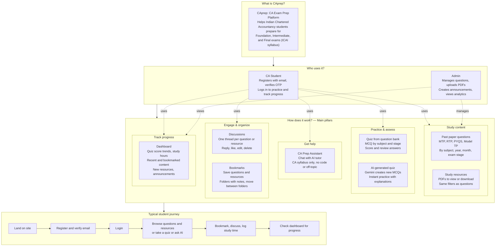
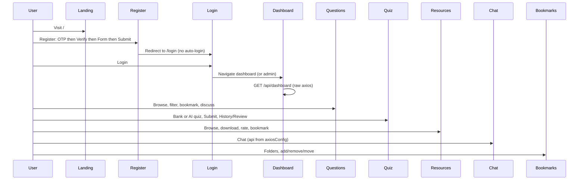
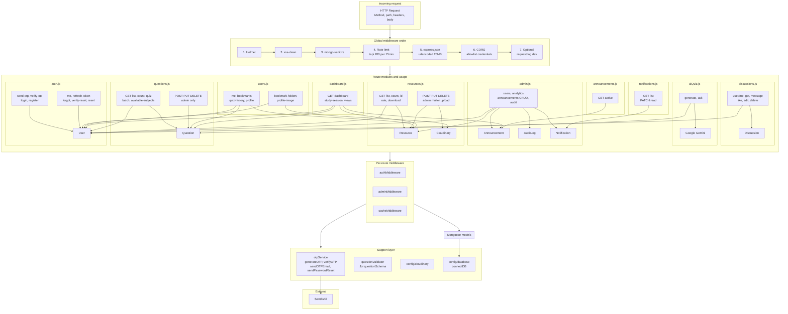

# CAprep

**CAprep** is a full-stack web application for Indian Chartered Accountancy (CA) exam preparation. It provides past papers (MTP, RTP, PYQS, Model TP), practice questions, AI-generated quizzes, study resources (PDFs), discussions, bookmarks, progress tracking, and an AI chat assistant—all tailored to Foundation, Intermediate, and Final exam stages.

---

## Table of Contents

1. [Project Title & Overview](#1-project-title--overview)
2. [Problem Statement](#2-problem-statement)
3. [Key Features](#3-key-features)
4. [Tech Stack](#4-tech-stack)
5. [System Architecture](#5-system-architecture)
6. [Folder Structure Breakdown](#6-folder-structure-breakdown)
7. [API Documentation Overview](#7-api-documentation-overview)
8. [Database Design](#8-database-design)
9. [Authentication & Security](#9-authentication--security)
10. [Environment Variables](#10-environment-variables)
11. [Installation Guide](#11-installation-guide)
12. [Production Deployment Guide](#12-production-deployment-guide)
13. [Scripts & Commands](#13-scripts--commands)
14. [Scalability & Performance Considerations](#14-scalability--performance-considerations)
15. [Limitations](#15-limitations)
16. [Future Roadmap](#16-future-roadmap)
17. [Contribution Guidelines](#17-contribution-guidelines)
18. [Observations](#18-observations)

---

## 1. Project Title & Overview

- **Title:** CAprep  
- **Purpose:** Help CA students prepare for ICAI exams by providing:
  - Curated and AI-generated practice questions (MCQs)
  - Downloadable study resources (PDFs) by subject, paper type, year, and month
  - Quiz taking with scoring and history
  - AI tutor (chat) for CA syllabus–related questions
  - Discussions on questions and resources
  - Bookmarks (flat and folder-based), profile, and dashboard with study analytics

The system is built as a **monolith**: a React (Vite) frontend and an Express.js backend that connects to MongoDB, with file storage on Cloudinary and email via SendGrid.

---

## 2. Problem Statement

CA students need:

- **Structured practice** aligned with ICAI syllabus and exam stages (Foundation, Intermediate, Final).
- **Past papers and resources** in one place, filterable by subject, paper type, and period.
- **Self-assessment** through quizzes and progress tracking.
- **Clarifications** on concepts without always depending on human tutors.
- **Organization** of study material (bookmarks, folders, notes) and visibility into progress (study hours, quiz trends).

CAprep addresses these by providing a single platform for questions, resources, AI-generated quizzes, an AI chat assistant, discussions, bookmarks, and a dashboard.

---

## 3. Key Features

- **Authentication & user management**
  - Email/password registration with **OTP email verification** (SendGrid).
  - Login with rate limiting and optional token refresh.
  - Forgot password flow: request OTP → verify OTP → set new password.
  - Profile: update name, profile picture (Cloudinary), view bookmarks and quiz history.
  - Account deletion with password confirmation.

- **Questions**
  - List/filter questions by subject, paper type, year, month, exam stage, search, and bookmarked.
  - Pagination (default 20, max 100 per page).
  - Admin: create, update, delete questions (Joi validation).
  - Question model supports main question, sub-questions, and sub-options (MCQs).

- **Resources (PDFs)**
  - List/filter by subject, paper type, exam stage, year, month, search, bookmarked.
  - Pagination; single resource by ID.
  - Admin: upload PDF (multer → Cloudinary, 20MB limit), update metadata, delete (Cloudinary asset removed).
  - Download: authenticated; backend can proxy Cloudinary PDF or return download URL; download count incremented.
  - Rate resource (1–5); model stores average and count.

- **Quizzes**
  - **Bank quiz:** MCQ questions from DB by exam stage and subject (random sample).
  - **AI quiz:** Google Gemini generates MCQs by subject and exam stage; uses existing questions as few-shot examples; returns JSON array of questions with options, correct index, and explanation.
  - Quiz results (score, total, percentage, questions attempted) saved to user’s quiz history (with per-question attempt detail for review).

- **AI Chat (CA Prep Assistant)**
  - Authenticated chat with Google Gemini; system prompt restricts to CA syllabus and denies code/general topics; supports conversation history.

- **Discussions**
  - One discussion per item (question or resource); thread-style messages with optional parent; like; edit/delete (author or admin).

- **Bookmarks**
  - **Flat:** bookmarked question IDs and resource IDs on user.
  - **Folders:** create folders (question/resource), add items with optional notes, rename folder, remove item, update note, move item between folders.

- **Dashboard**
  - Aggregated data: quiz score trends, study hours (daily/weekly/monthly/by subject), recently viewed questions/resources, bookmarks, subject strengths, resource engagement (time spent, access count), new resources (last 14 days), active announcements.

- **Study tracking**
  - Study session (e.g. Pomodoro): POST hours + optional subject/date.
  - Question view and resource view: track recently viewed and resource engagement (time spent, access count).

- **Announcements**
  - Admin: create/update/delete; type, priority, target subjects, valid until.
  - On create, in-app notifications are created for all users (fire-and-forget).
  - Users: list active announcements (by validity and priority).

- **Notifications**
  - In-app notifications (announcement, reply, system, general); list (paginated), unread count, mark one or all as read.

- **Admin**
  - Bootstrap: if no admin exists, one is created from `ADMIN_EMAIL`, `ADMIN_PASSWORD`, `ADMIN_FULL_NAME`.
  - Admin panel: user list (paginated), analytics (top downloaded resources, quizzes per subject, total “donations” from user.totalContribution), audit log (paginated), announcements CRUD, clear cache.

- **PWA**
  - manifest.json and service worker (cache-first for same-origin static assets; API requests not cached).

---

## 4. Tech Stack

| Category | Technology |
|----------|------------|
| **Frontend** | React 19, React Router 7, Vite 6, Tailwind CSS 4, Axios, Framer Motion, AOS, Chart.js (react-chartjs-2), react-pdf, html2pdf/jspdf, DOMPurify, react-helmet, react-error-boundary, @vercel/analytics |
| **Backend** | Node.js, Express 4, Mongoose 8 |
| **Database** | MongoDB (no separate ORM; Mongoose as ODM) |
| **Auth** | JWT (access token, optional refresh via `/auth/refresh-token`), bcrypt for passwords |
| **File storage** | Cloudinary (PDF upload, optional proxy for download) |
| **Email** | SendGrid |
| **AI** | Google Gemini (`@google/generative-ai`); model configurable via `GEMINI_MODEL` (default `gemini-2.5-flash-lite`) |
| **Validation** | Joi (e.g. question create/update) |
| **Security** | Helmet, xss-clean, express-mongo-sanitize, express-rate-limit (global + route-specific), CORS allowlist |
| **Caching** | node-cache (in-memory); cache middleware for GET routes; admin clear-cache endpoint |
| **DevOps / Hosting** | Frontend: Vercel (vercel.json with SPA rewrite, buildCommand, outputDirectory `dist`). Backend: not in repo (e.g. Render); no Docker or CI config in repo |

---

## 5. System Architecture

### Project overview: what CAprep is and how it works

This diagram explains the project from a product perspective—what it is, who it is for, and how the main parts fit together. No technical implementation details, just the idea of the product.



In one sentence: **CAprep is a CA exam prep web app where students study past questions and PDFs, take bank or AI-generated quizzes, chat with an AI tutor, discuss and bookmark content, and track their progress on a dashboard—while admins manage content and announcements.**

### Complete user journey (traced in code)

This sequence diagram traces the typical user path through the app and the components/API calls involved, as reflected in the codebase.



---

### Architecture diagram (high-level, detailed)

```mermaid
flowchart TB
    subgraph Client["Client (Browser)"]
        direction TB
        subgraph FrontendCore["Frontend core"]
            Router["React Router 7"]
            Main["main.jsx<br/>createRoot, SW register"]
            App["App.jsx<br/>Routes, ProtectedRoute,<br/>ErrorBoundary, AuthRedirect"]
            Main --> App
            App --> Router
        end
        subgraph Pages["Pages & features"]
            Landing["Landing, About,<br/>Contact, FAQ"]
            AuthPages["Login, Register,<br/>ForgotPassword, ResetPassword"]
            AppPages["Dashboard, Questions,<br/>Quiz, QuizHistory, Resources,<br/>Bookmarks, UserProfile"]
            Chat["ChatBotPage<br/>(AI assistant)"]
            AdminPages["AdminPanel, ResourceUploader,<br/>AdminAnnouncements, Analytics"]
        end
        subgraph FrontendUtils["Utils & state"]
            AxiosConfig["axiosConfig.js<br/>baseURL, interceptors<br/>Bearer token, 401 refresh"]
            ApiUtils["apiUtils.js<br/>getApiBaseUrl, getAuthToken,<br/>refreshToken, get/post"]
            LocalStorage["localStorage<br/>auth object, token, expires"]
        end
        PWA["PWA: manifest.json<br/>Service worker cache static"]
        Router --> Pages
        Pages --> AxiosConfig
        AxiosConfig --> ApiUtils
        ApiUtils --> LocalStorage
        FrontendCore --> PWA
    end

    subgraph Backend["Backend (Node.js / Express)"]
        direction TB
        Server["server.js<br/>Trust proxy, startServer"]
        subgraph Security["Security & global middleware"]
            Helmet["Helmet"]
            XSS["xss-clean"]
            MongoSanitize["express-mongo-sanitize"]
            RateLimit["express-rate-limit<br/>200 req / 15 min per IP"]
            BodyParser["express.json 20MB<br/>urlencoded 20MB"]
            CORS["CORS allowlist<br/>credentials true"]
        end
        Bootstrap["bootstrap/routes.js<br/>mountRoutes"]
        subgraph RouteGroups["API route groups"]
            R1["/api/auth<br/>send-otp, verify-otp, login,<br/>register, me, refresh-token,<br/>forgot-password, reset-password"]
            R2["/api/questions<br/>CRUD admin, list, count,<br/>quiz, available-subjects, batch"]
            R3["/api/resources<br/>list, get, rate, CRUD admin,<br/>download, download-url"]
            R4["/api/users<br/>me, bookmarks, quiz-history,<br/>profile, bookmark-folders"]
            R5["/api/admin<br/>users, analytics, announcements,<br/>audit, clear-cache"]
            R6["/api/ai-quiz<br/>generate, ask"]
            R7["/api/discussions<br/>user/me, item messages,<br/>like, edit, delete"]
            R8["/api/dashboard<br/>data, study-session,<br/>views, resource-engagement"]
            R9["/api/announcements<br/>GET active"]
            R10["/api/notifications<br/>list, read-all, mark read"]
        end
        subgraph BackendMiddleware["Per-route middleware"]
            AuthMW["authMiddleware<br/>JWT verify, req.user"]
            AdminMW["adminMiddleware<br/>role admin"]
            CacheMW["cacheMiddleware<br/>GET cache by user+URL"]
        end
        Server --> Security
        Server --> Bootstrap
        Bootstrap --> RouteGroups
        RouteGroups --> AuthMW
        RouteGroups --> AdminMW
        RouteGroups --> CacheMW
    end

    subgraph DataLayer["Data layer"]
        subgraph MongoDB["MongoDB collections"]
            Users[(users)]
            Questions[(questions)]
            Resources[(resources)]
            Discussions[(discussions)]
            Notifications[(notifications)]
            Announcements[(announcements)]
            AuditLogs[(auditlogs)]
        end
        Mongoose["Mongoose<br/>connectDB, models"]
    end

    subgraph External["External services"]
        Cloudinary["Cloudinary<br/>PDF upload, profile image<br/>folder ca-exam-platform/resources"]
        SendGrid["SendGrid<br/>OTP email, password reset<br/>verified_emails.json fallback"]
        Gemini["Google Gemini<br/>AI quiz generate<br/>Chat ask with system prompt"]
    end

    Client -->|HTTPS REST<br/>Authorization Bearer| Backend
    Backend --> Mongoose
    Mongoose --> MongoDB
    Backend -->|upload_stream, destroy| Cloudinary
    Backend -->|sgMail| SendGrid
    Backend -->|generateContent, startChat| Gemini
```



### Request–response flow diagram (detailed)


### Component diagram (backend layers, detailed)



*Diagrams use [Mermaid](https://mermaid.js.org/); they render on GitHub and in editors that support Mermaid.*

### 5.1 High-level

- **Style:** Monolith — one frontend app and one backend API.
- **Frontend:** SPA (React) served as static files; all data via REST API.
- **Backend:** Express app; middleware chain (security → body parser → CORS → optional request logging → routes); DB and admin bootstrap on startup; then mount routes and start HTTP server.

### 5.2 Component-level

- **Frontend:**  
  - `main.jsx`: mounts App, registers service worker in production.  
  - `App.jsx`: Router, ErrorBoundary, route definitions, ProtectedRoute / RedirectIfLoggedIn, AuthRedirectSetup (axios 401 → navigate to login).  
  - Pages/components call API via `axios` instance (from `axiosConfig.js`) or `apiUtils` (get/post, token refresh, error handling).  
  - Auth state: JWT and optional expiry in `localStorage` (`auth` object; fallback `token` key).

- **Backend:**  
  - **Entry:** `server.js` — connect DB, run admin bootstrap, mount routes from `bootstrap/routes.js`, then start listen.  
  - **Routes:** Mounted under `/api/*`: auth, questions, resources, users, admin, ai-quiz, discussions, dashboard, announcements (with auth), notifications (with auth).  
  - **Layers:** Route handlers use models and services directly (no separate service/repository folders); validators (e.g. Joi) and middleware (auth, admin, cache) are used per route.

### 5.3 Request–response lifecycle

1. Client sends request (e.g. `GET /api/questions?subject=...`) with optional `Authorization: Bearer <token>`.
2. Global rate limiter (e.g. 200 req/15 min per IP) and CORS run first.
3. Route-specific middleware: e.g. `authMiddleware` (verify JWT, attach `req.user`), `adminMiddleware` (require `req.user.role === 'admin'`), `cacheMiddleware(duration)` (GET only; cache key by user id + URL; skip if `x-skip-cache: true`).
4. Handler reads DB (Mongoose), optionally clears cache on mutations, returns JSON.
5. If an error is thrown, global error handler and 404 handler at the end of the chain return 500/404 JSON.

### 5.4 Data flow (typical)

- **Login:** POST `/api/auth/login` → validate email/password, bcrypt compare, JWT sign → response with token and expiry; frontend stores in `localStorage` and uses in `Authorization` header.
- **Refresh:** On 401 (or when expiry is near), frontend calls POST `/api/auth/refresh-token` with current token; backend issues new token; frontend updates storage and retries request.
- **Protected GET:** Axios interceptor adds Bearer token; backend authMiddleware validates JWT and loads user; cache middleware may return cached body for same user+URL.
- **Admin mutation:** authMiddleware + adminMiddleware; handler updates DB; `clearCache(...)` for affected keys; response returned.

### 5.5 Authentication & authorization architecture

- **Authentication:** JWT in `Authorization: Bearer <token>`. Verified in `authMiddleware` (algorithm HS256, expiry from `JWT_EXPIRES_IN`); user loaded from DB and `req.user` set to `{ id, fullName, email, role }`.
- **Authorization:** Role-based: `adminMiddleware` allows only `role === 'admin'`. Routes that need “any logged-in user” use only `authMiddleware`; admin-only routes use both.
- **Registration:** OTP sent to email (SendGrid); user must verify OTP before `/api/auth/register` succeeds; password hashed with bcrypt (12 rounds).
- **Password reset:** Forgot password sends OTP by email; user verifies OTP then submits new password; reset tokens stored hashed and with expiry on User model.

---

## 6. Folder Structure Breakdown

```
CAPrep/
├── .gitignore
├── README.md
├── frontend/
│   ├── index.html              # Single HTML entry; root div; loads main.jsx
│   ├── package.json            # React, Vite, Tailwind, axios, chart, etc.
│   ├── vite.config.js           # Vite + React + Tailwind plugins; publicDir: public
│   ├── .env.example             # VITE_API_URL (backend API base URL including /api)
│   ├── vercel.json              # SPA rewrite, buildCommand, outputDirectory, headers
│   ├── public/
│   │   ├── manifest.json        # PWA name, theme, icons, start_url
│   │   └── sw.js                # Service worker: cache static assets; no API cache
│   ├── src/
│   │   ├── main.jsx             # React root; service worker registration (prod)
│   │   ├── App.jsx               # Router, routes, protected/auth redirect, ErrorBoundary
│   │   ├── index.css             # Global styles (Tailwind entry)
│   │   ├── utils/
│   │   │   ├── axiosConfig.js    # Axios instance (baseURL from apiUtils), interceptors (token, 401 refresh/redirect)
│   │   │   └── apiUtils.js       # getApiBaseUrl, get/set/clear auth token, refreshToken, get/post, handleError
│   │   ├── components/           # Reusable UI and feature components
│   │   │   ├── Login.jsx, Register.jsx, ForgotPassword.jsx, ResetPassword.jsx
│   │   │   ├── Navbar.jsx, UserProfile.jsx, EditProfile.jsx
│   │   │   ├── Questions.jsx, Quiz.jsx, QuizHistory.jsx, Resources.jsx, ResourceUploader.jsx
│   │   │   ├── Dashboard.jsx, BookmarksPage.jsx, BookmarkFolderSelector.jsx
│   │   │   ├── DiscussionModal.jsx, NotificationsDropdown.jsx
│   │   │   ├── AdminPanel.jsx, AdminAnnouncements.jsx, AdminAnalytics.jsx
│   │   │   ├── ErrorBoundary.jsx, Skeleton.jsx
│   │   │   └── *.css for components
│   │   └── pages/
│   │       ├── LandingPage.jsx, About.jsx, ContactUs.jsx, FAQ.jsx
│   │       ├── ChatBotPage.jsx, QuizReview.jsx
│   │       └── ChatBotPage.css
│   └── dist/                    # Production build output (git may ignore or commit)
│
└── backend/
    ├── server.js               # Express app, security middleware, rate limit, CORS, connectDB, admin bootstrap, mountRoutes, health, error/404 handlers
    ├── package.json             # express, mongoose, bcrypt, jwt, multer, cloudinary, etc.
    ├── .env.example             # All env vars documented below
    ├── .env                     # Local secrets (gitignored)
    ├── config/
    │   ├── database.js          # connectDB (MongoDB with retry and connection options)
    │   ├── cloudinary.js         # Cloudinary v2 config from env
    │   └── logger.js            # Simple console logger (info, error, warn, debug)
    ├── bootstrap/
    │   ├── routes.js            # mountRoutes: mount all route modules under /api/*
    │   └── adminBootstrap.js    # checkAndCreateAdmin from env if no admin exists
    ├── middleware/
    │   ├── authMiddleware.js    # authMiddleware (JWT verify, set req.user), adminMiddleware (role check)
    │   └── cacheMiddleware.js   # cacheMiddleware(ttl), clearCache(pattern), clearAllCache()
    ├── models/
    │   ├── UserModel.js         # User: auth, profile, quizHistory, bookmarks, studyHours, bookmarkFolders, etc.
    │   ├── QuestionModel.js      # Question: subject, paperType, year, month, examStage, questionText, subQuestions
    │   ├── ResourceModel.js     # Resource: title, subject, fileUrl, fileType, rating, downloadCount, etc.
    │   ├── DiscussionModel.js   # Discussion: itemType/itemId, messages (with userId, likes, parent), participants
    │   ├── NotificationModel.js # Notification: user, type, title, body, read, refId, refType
    │   ├── AnnouncementModel.js  # Announcement: title, content, type, priority, targetSubjects, validUntil, createdBy
    │   └── AuditLogModel.js     # AuditLog: actor, action, resource, resourceId, details
    ├── routes/
    │   ├── auth.js              # send-otp, verify-otp, login, register, me, refresh-token, forgot-password, verify-reset-otp, reset-password
    │   ├── questions.js         # CRUD (admin), list (filter, pagination), count, quiz (MCQ sample), available-subjects, all-subjects, batch
    │   ├── resources.js        # List, count, get by id, rate, create (admin upload), update/delete (admin), download (proxy/URL), download count increment
    │   ├── users.js             # me (profile, bookmarks), bookmarks CRUD, quiz-history CRUD, profile update, profile image upload, delete account, bookmark folders CRUD
    │   ├── admin.js             # users list, analytics, announcements CRUD, audit log
    │   ├── dashboard.js        # GET dashboard data, study-session, resource-engagement, question-view, resource-view, announcements
    │   ├── aiQuiz.js            # POST generate (AI MCQs), POST ask (chat with Gemini)
    │   ├── discussions.js       # user/me, get by itemType+itemId, post message, like, edit, delete message
    │   ├── announcements.js     # GET active announcements (public under /api/announcements but route mounted with authMiddleware)
    │   └── notifications.js     # GET list, PATCH read-all, PATCH :id/read
    ├── services/
    │   └── otpService.js        # generateOTP, verifyOTP, sendOTPEmail, isEmailVerified, markEmailAsVerified, removeVerifiedEmail, sendPasswordResetEmail; in-memory + file (database/verified_emails.json)
    ├── validators/
    │   └── questionValidator.js # Joi questionSchema for create/update
    └── database/               # Optional local file storage (e.g. verified_emails.json); may be gitignored
```

---

## 7. API Documentation Overview

### Base URL

- Development: `http://localhost:5000/api` (or whatever `PORT` and `VITE_API_URL` are set to).
- Production: Set `VITE_API_URL` in frontend env to backend base URL including `/api` (e.g. `https://your-backend.onrender.com/api`).

### Route grouping and authentication

| Prefix | Auth | Description |
|--------|------|-------------|
| `/api/auth` | Mixed | send-otp, verify-otp, login, register (public); me, refresh-token (Bearer); forgot-password, verify-reset-otp, reset-password (public) |
| `/api/questions` | Mixed | GET / (auth, cache), GET /count (cache), GET /quiz, /available-subjects, /all-subjects (auth), POST /batch (auth); POST/PUT/DELETE (admin) |
| `/api/resources` | Mixed | GET /, GET /count, GET /:id (auth where required); POST /:id/rate (auth); POST / (admin, multipart); PUT/DELETE /:id (admin); GET/POST /:id/download, GET /:id/download-url (auth for download) |
| `/api/users` | Auth | Profile, bookmarks, quiz history, profile image, bookmark folders |
| `/api/admin` | Auth + Admin | users, analytics, announcements CRUD, audit, clear-cache (POST) |
| `/api/ai-quiz` | Auth | POST /generate, POST /ask |
| `/api/discussions` | Auth | user/me, :itemType/:itemId, message, like, edit, delete |
| `/api/dashboard` | Auth | GET /, study-session, resource-engagement, question-view, resource-view, announcements |
| `/api/announcements` | Auth (mount) | GET / (active announcements) |
| `/api/notifications` | Auth (mount) | GET /, PATCH read-all, PATCH :id/read |

### Sample request/response

- **Login**  
  `POST /api/auth/login`  
  Body: `{ "email": "user@example.com", "password": "***" }`  
  Response: `200` — `{ "message", "token", "expires", "user": { "id", "fullName", "email", "role" } }`

- **List questions**  
  `GET /api/questions?subject=Accounting&examStage=Foundation&page=1&limit=20`  
  Headers: `Authorization: Bearer <token>`  
  Response: `200` — `{ "data": [...], "pagination": { "total", "page", "pages", "limit" } }`

- **Create question (admin)**  
  `POST /api/questions`  
  Headers: `Authorization: Bearer <admin-token>`  
  Body: `{ "subject", "paperType", "year", "month", "examStage", "questionNumber", "questionText", "answerText", "subQuestions" }`  
  Response: `201` — `{ "id", ...questionData }`

---

## 8. Database Design

- **Database:** MongoDB; connection via Mongoose from `config/database.js` using `MONGODB_URI`.
- **Collections (Mongoose models):**
  - **users:** fullName, email (unique), password (select:false), role (user|admin), profilePicture, resetPasswordToken/Expires, createdAt/updatedAt; bookmarkedQuestions[], bookmarkedResources[], quizHistory[] (with questionsAttempted), studyHours[], recentlyViewedQuestions[], recentlyViewedResources[], subjectStrengths[], resourceEngagement[], bookmarkFolders[] (name, type, items with itemId, note); totalContribution. Validators cap array lengths (e.g. quizHistory ≤ 100, studyHours ≤ 365).
  - **questions:** subject, paperType, year, month, examStage, questionNumber, questionText, answerText, subQuestions[] (subQuestionText, subOptions[] with optionText, isCorrect), difficulty, viewCount, attemptCount, correctCount. Indexes for filters and text search.
  - **resources:** title, subject, paperType, year, month, examStage, fileUrl, fileType, fileSize, downloadCount, viewCount, description, rating (average, count), lastUpdated. Indexes for filters and text search.
  - **discussions:** itemType (question|resource), itemId, itemModel (Question|Resource), lastActivityAt, messageCount, participantCount, messages[] (userId, content, timestamp, parentMessageId, likes[], edited, deleted), participants[]. Indexes for itemType+itemId (unique), participants, lastActivityAt.
  - **notifications:** user, type (announcement|reply|system|general), title, body, read, refId, refType, timestamps.
  - **announcements:** title, content, type, priority, targetSubjects[], validUntil, createdBy, viewCount, dismissedBy[], acknowledgedBy[], needsAcknowledgment. Indexes for type, priority, validUntil, text search.
  - **auditlogs:** actor, action, resource, resourceId, details, timestamps.

- **Relationships:** User references in Discussion (participants, messages.userId), Announcement (createdBy), Notification (user), AuditLog (actor). Discussion references Question/Resource via itemId + itemModel. User bookmarks reference Question and Resource by ObjectId.

- **Constraints:** Unique email on users; unique (itemType, itemId) on discussions; Joi and Mongoose validators on inputs and schema (e.g. question subject by examStage, array caps).

---

## 9. Authentication & Security

- **Token handling:** JWT access token stored in frontend `localStorage` (key `auth` with token and expires; fallback `token`). Axios request interceptor adds `Authorization: Bearer <token>`. On 401 (e.g. TOKEN_EXPIRED), frontend attempts refresh via POST `/api/auth/refresh-token`; on success retries request; on failure clears token and redirects to login.
- **Role-based access:** Admin-only routes use `adminMiddleware` after `authMiddleware`; non-admin users receive 403.
- **Security measures:** Helmet, xss-clean, express-mongo-sanitize; global API rate limit (e.g. 200/15 min per IP); stricter limits on login, send-otp, forgot-password; login attempt tracking per email+IP with block after 5 failures; bcrypt (12 rounds); OTP and reset token hashed (SHA-256) and expiry; CORS allowlist from env (`CORS_ORIGIN`); JWT algorithm and expiry enforced.

---

## 10. Environment Variables

### Backend (`.env`; see `.env.example`)

| Variable | Purpose |
|----------|---------|
| `PORT` | HTTP server port (default 5000) |
| `NODE_ENV` | development \| production |
| `MONGODB_URI` | MongoDB connection string |
| `JWT_SECRET` | Secret for signing JWTs |
| `JWT_EXPIRES_IN` | Access token expiry (e.g. 1d) |
| `JWT_REFRESH_SECRET` | Optional; refresh token secret if used |
| `JWT_REFRESH_EXPIRES_IN` | Optional; refresh token expiry |
| `CORS_ORIGIN` | Comma-separated allowed origins (e.g. http://localhost:5173, https://caprep.vercel.app) |
| `GEMINI_API_KEY` | Google Gemini API key for AI quiz and chat |
| `GEMINI_MODEL` | Optional; model name (default gemini-2.5-flash-lite) |
| `CLOUDINARY_CLOUD_NAME`, `CLOUDINARY_API_KEY`, `CLOUDINARY_API_SECRET` | Cloudinary for PDF and profile images |
| `SENDGRID_API_KEY`, `SENDGRID_FROM_EMAIL` | SendGrid for OTP and password reset |
| `ADMIN_EMAIL`, `ADMIN_PASSWORD`, `ADMIN_FULL_NAME` | Bootstrap first admin if none exist |
| `CACHE_TTL`, `CACHE_CHECK_PERIOD` | Optional; node-cache tuning |
| `RATE_LIMIT_MAX_REQUESTS`, `RATE_LIMIT_WINDOW_MS` | Optional; override default rate limit |

### Frontend (`.env`; see `.env.example`)

| Variable | Purpose |
|----------|---------|
| `VITE_API_URL` | Backend API base URL including `/api` (e.g. http://localhost:5000/api or https://your-api.com/api) |

---

## 11. Installation Guide

1. **Clone the repository**
   ```bash
   git clone <repo-url>
   cd CAPrep
   ```

2. **Backend**
   ```bash
   cd backend
   npm install
   cp .env.example .env
   # Edit .env: set MONGODB_URI, JWT_SECRET, and optionally GEMINI_API_KEY, Cloudinary, SendGrid/EMAIL_*
   npm run dev   # or node server.js
   ```
   Server runs at `http://localhost:5000`. Health: `GET /health`.

3. **Frontend**
   ```bash
   cd frontend
   npm install
   cp .env.example .env
   # Set VITE_API_URL=http://localhost:5000/api
   npm run dev
   ```
   App runs at `http://localhost:5173` (or Vite’s default).

4. **First run**
   - Ensure MongoDB is reachable; on first start the backend creates an admin user from `ADMIN_EMAIL`/`ADMIN_PASSWORD` if no admin exists.
   - Register a normal user (OTP required if email is configured) or log in as admin.

---

## 12. Production Deployment Guide

- **Backend**
  - Set `NODE_ENV=production`.
  - Set all required env vars (MongoDB, JWT, CORS, Gemini, Cloudinary, SendGrid, admin bootstrap).
  - Run `npm install --omit=dev` and start with `node server.js` or a process manager (e.g. PM2).
  - No Docker or Dockerfile is present in the repo; you can add one if needed.

- **Frontend**
  - Set `VITE_API_URL` to the production API URL (including `/api`).
  - Build: `npm run build` (output in `dist/`).
  - Deploy `dist/` to a static host; for Vercel, use `vercel.json` (rewrites, buildCommand, outputDirectory `dist`).

- **Required services**
  - MongoDB (Atlas or self-hosted).
  - Cloudinary (for PDFs and profile images).
  - SendGrid (for OTP and password reset).
  - Google AI (Gemini) for AI quiz and chat.

---

## 13. Scripts & Commands

### Backend (`backend/package.json`)

| Script | Command | Description |
|--------|---------|-------------|
| `start` | `node server.js` | Run production server |
| `dev` | `nodemon server.js` | Run with auto-restart on file changes |
| `test` | `echo "Error: no test specified" && exit 1` | Placeholder; no tests configured |

### Frontend (`frontend/package.json`)

| Script | Command | Description |
|--------|---------|-------------|
| `dev` | `vite` | Start Vite dev server |
| `build` | `vite build` | Production build to `dist/` |
| `preview` | `vite preview` | Preview production build locally |
| `lint` | `eslint .` | Run ESLint |

---

## 14. Scalability & Performance Considerations

- **Caching:** In-memory (node-cache) for GET responses (per user + URL); TTL and pattern-based clear on mutations; admin can clear all cache. Not distributed; for multi-instance backends, consider Redis.
- **Rate limiting:** Global and per-route limits reduce abuse; login/send-otp/forgot-password have stricter limits.
- **Pagination:** Questions, resources, users, notifications, audit log, and announcements use limit/skip or equivalent to avoid large responses.
- **Indexes:** Mongoose schemas define indexes for common filters (subject, examStage, paperType, year, month) and text search where used.
- **File uploads:** 20MB body limit and multer limit; Cloudinary handles storage and CDN; download can be proxied or URL-returned.
- **OTP/verified emails:** In-memory with optional file persistence (`database/verified_emails.json`); for horizontal scaling, move to Redis or DB.

---

## 15. Limitations

- Single backend process: in-memory cache and OTP/verified-email state are not shared across instances.
- Refresh token rotation: when `JWT_REFRESH_SECRET` and `JWT_REFRESH_EXPIRES_IN` are set, login/register issue a refresh token and `/auth/refresh-token` accepts it in the request body to issue new access (and new refresh) tokens; otherwise only access-token refresh (with Bearer) is used.
- Question validator year: Joi allows 2023 through current year + 1 (updated dynamically).
- No automated tests or CI/CD in the repository.
- PWA service worker caches selected GET APIs (questions, resources, dashboard, announcements) with network-first and cache fallback for offline; other API calls are not cached.

---

## 16. Future Roadmap

- Extend question year validation and paper types/subjects as per ICAI when new exams are announced.
- Introduce Redis (or similar) for cache and OTP/verification state when scaling to multiple backend instances.
- Add unit and integration tests; optional CI (e.g. GitHub Actions) for lint and test.
- Optional refresh token rotation and stricter token revocation (e.g. blocklist or short-lived refresh tokens).
- Improve offline support (e.g. cache critical API responses in service worker where appropriate).

---

## 17. Contribution Guidelines

- Follow existing code style (ESLint for frontend).
- For new API routes, use existing middleware (auth, admin, cache) and error response format.
- For schema changes, consider indexes and backward compatibility; document in README or migrations.
- Keep `.env` and secrets out of version control; update `.env.example` when adding new variables.

---

## 18. Observations

- **(Removed)** Resource schema now includes `resourceType`; no longer a limitation. With Mongoose’s default strict mode, this field may not be persisted. The dashboard and dashboard route reference `resourceType` (with fallback `'PDF'`). Adding `resourceType` to the Resource schema is recommended for consistency.
- **Policy pages:** App comments mention “Policy page routes removed”; no policy routes or components are present.
- **Logger:** `config/logger.js` is a thin wrapper around console; not all routes use it (some use `console.log`/`console.error` directly).
- **Analytics “donations”:** Admin analytics uses `totalContribution` from users; there is no payment or donation flow in the codebase, so this may be a placeholder for future use.
- **Audit log:** Written on admin announcement create/update/delete; other admin actions (e.g. question/resource CRUD) do not write to AuditLog.
- **verified_emails.json:** Stored under `backend/database/`; directory is in `.gitignore`; the server creates the directory at startup if it does not exist.

---

*This README was generated from a full codebase analysis. For the latest API and env details, refer to the source and `.env.example` files.*
